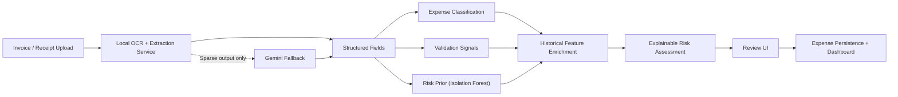

# AI-Powered Intelligent Invoice Understanding and Expense Analytics System

This repository contains a master's project prototype that combines a Spring Boot and Vaadin application with a Python invoice-extraction workspace. The current system is positioned as an intelligent invoice understanding platform rather than a basic expense logger: it ingests invoice images, performs OCR, extracts structured fields, validates the result, and stores the expense record for human review.

## Problem statement

Manual invoice entry is slow, error-prone, and difficult to scale in small organizations and academic prototype settings. OCR alone is insufficient because financial documents contain noisy layouts, inconsistent headers, partial metadata, and line-item variability. This project addresses that gap with a hybrid pipeline that combines OCR, a local extraction service, a controlled external fallback, and rule-based validation for invoice understanding and expense analytics.

## What is implemented

- Java Spring Boot backend with Vaadin UI for upload, review, correction, and persistence
- Local-first extraction pipeline that calls the Python extraction service before any external fallback
- OCR preprocessing and text extraction in the Java backend
- Structured expense model including vendor, dates, totals, payment metadata, and line items
- Validation service that highlights suspicious or incomplete invoices for manual review
- Explicit AI classification output with predicted category, confidence, and alternative labels
- Fixed business-category dropdown with `Other` override support in the review form
- Automatic category preselection from uploaded invoice content using expanded rules-based category scoring
- Hybrid anomaly scoring that combines an Isolation Forest prior with explainable business-risk signals
- Python ML workspace for dataset normalization, OCR generation, training, and evaluation
- Evaluation artifacts under [`ml/training_data/reports`](/Users/tamilselvans/M.E/tamil/project/expensetracker/ml/training_data/reports)

## What is experimental

- External Gemini-based fallback used only when the local service cannot extract enough structure
- Prototype anomaly/fraud services in [`ml/experimental`](/Users/tamilselvans/M.E/tamil/project/expensetracker/ml/experimental)
- Structured transformer evaluation is still marked as pending a clean full rerun after the parser fix; the repository keeps the spot-check and legacy comparison reports rather than overstating results

## System architecture

1. User uploads an invoice or receipt through the Vaadin interface.
2. The backend stores the binary temporarily and sends it to the local Python extraction service.
3. If the local service returns enough structured content, the result is normalized and validated.
4. The category classifier predicts the most likely expense class together with confidence and alternatives.
5. The anomaly module produces a prior risk score, and the backend blends it with duplicate, reconciliation, and history-based review signals.
6. If local extraction is insufficient and external fallback is enabled, OCR text is generated in Java and sent to Gemini for structured JSON extraction.
7. The normalized expense, AI classification, and explainable risk assessment are shown in the UI for review and then saved in MySQL.

## Architecture diagram



## Hybrid extraction pipeline

- Local model first: the app calls the Python `POST /extract-image` endpoint and accepts the result when it contains a minimally useful structure such as amount, vendor, invoice number, or line items.
- External fallback second: the app only calls Gemini when the local result is empty or too sparse.
- Semantic classification next: the local service and backend cooperate to produce a visible predicted category with confidence.
- Review-form category selection: the upload flow preselects the most relevant category from a fixed business dropdown, while still allowing a manual `Other` value.
- Hybrid risk scoring last: regardless of extraction source, the backend combines model-based anomaly priors with explainable business rules before presenting the result.

This design is defensible academically because it does not claim full automation. It explicitly keeps a human-in-the-loop review stage and uses the external model as a fallback rather than the primary path.

## Feature list

- Invoice image upload with preview
- OCR-backed field extraction
- Line-item capture
- Currency, date, vendor, client, and payment field extraction
- Manual review UI with editable form
- Fixed category dropdown with common business categories and custom `Other` support
- Validation signals for incomplete or inconsistent invoices
- AI risk card with risk score, band, explanation signals, and review recommendation
- Report dashboard for category distribution, risk distribution, and high-risk queue
- Expense persistence with relational storage
- Reproducible ML utility scripts for audit, preprocessing, training, and evaluation

## Tech stack

- Backend: Java 21, Spring Boot, Spring Data JPA
- Frontend: Vaadin
- Database: MySQL
- OCR: Tess4J, Tesseract, OpenCV preprocessing
- ML workspace: Python, scikit-learn, transformer-based structured predictor, Flask serving endpoint
- Classification: logistic regression with semantic embedding backend when available and TF-IDF fallback baseline
- Risk scoring: Isolation Forest anomaly prior with Java-side business-risk enrichment
- External fallback: Google Gemini API

## Configuration

The app no longer stores secrets or machine-specific paths in source files.

1. Copy [`.env.example`](/Users/tamilselvans/M.E/tamil/project/expensetracker/.env.example) to `.env`.
2. Fill in the database credentials and, if required, `GEMINI_API_KEY`.
3. Start MySQL, the local Python extraction service, and optionally LM Studio or the Gemini fallback.
4. Run the Spring Boot app with `./mvnw spring-boot:run`.

Spring Boot loads `.env` through `spring.config.import=optional:file:.env[.properties]`, so the file can stay local and uncommitted.

## ML pipeline summary

The Python workspace under [`ml`](/Users/tamilselvans/M.E/tamil/project/expensetracker/ml) supports:

- raw dataset ingestion from ZIP files
- dataset audit reporting
- canonical label normalization
- OCR text generation
- train/validation/test split creation
- legacy local model training
- category classifier training and evaluation
- anomaly/risk model training and evaluation
- structured header model training and evaluation
- local extraction service hosting

See [`ml/README.md`](/Users/tamilselvans/M.E/tamil/project/expensetracker/ml/README.md) for the presentation-ready summary and the regeneration workflow.

## Validation approach

The current application uses two review layers:

1. Deterministic validation rules
2. Hybrid anomaly scoring for review prioritization

The backend checks for:

- missing vendor, invoice number, or invoice date
- missing or non-positive totals
- negative tax or discount
- due date earlier than invoice date
- unusually high amounts beyond a configured threshold
- mismatch between line-item totals and header totals
- duplicate invoice numbers for the same vendor
- amount outliers relative to saved category history
- low-confidence or incomplete extraction

The Isolation Forest prior is used only as an anomaly score feeding review prioritization. It should be described as AI-assisted anomaly detection and explainable risk assessment, not as a supervised fraud classifier.

## Academic positioning

- Implemented and benchmarked:
  - invoice field extraction
  - supervised category classification
  - unsupervised anomaly prior
  - explainable business-risk enrichment
- Implemented but still evolving:
  - structured transformer header extraction
  - external fallback via Gemini
- Not claimed:
  - labeled fraud-detection accuracy
  - production-grade fraud prevention
  - state-of-the-art category modeling

## Reproducibility

The main reproducibility entrypoint is:

```bash
cd ml
./regenerate_reports.sh
```

That workflow rebuilds:
- dataset audit outputs
- normalized labels
- OCR artifacts
- train/validation/test splits
- legacy extraction model report
- category classifier report
- anomaly/risk report
- high-risk spot-check report
- exported risk feature matrix
- structured extraction report when structured artifacts are present

## Current benchmark snapshot

The generated reports currently support these repo-level observations:

- category classifier accuracy: `0.7887`
- category macro F1: `0.4470`
- anomaly model: `IsolationForest`
- documents flagged as `HIGH` risk in the checked-in test split: `7`
- heuristic-overlap among those flagged cases: `7`

These are dataset-specific evidence points for the current repository state, not generalized production guarantees.

## Current limitations

- The external fallback depends on API availability and is not used offline unless configured
- OCR quality still depends on image quality and Tesseract behavior
- The anomaly module is unsupervised and should not be presented as labeled fraud detection
- Category classification currently falls back to a TF-IDF baseline when semantic embedding dependencies are unavailable
- The expanded business-category dropdown is currently driven by rules-based recommendation on top of the smaller benchmarked label set
- The structured transformer report still needs a full rerun after the parser fix
- The app does not yet include workflow features such as approval routing, user roles, or audit logging

## Future improvements

- expand the labeled invoice dataset across more document templates
- add confidence calibration and field-level uncertainty reporting in the UI
- compare OCR engines and document preprocessing strategies systematically
- introduce benchmark datasets and repeatable evaluation baselines
- add authentication, authorization, and audit trails for production deployment
- package the Python extraction service with containerized deployment and health monitoring
